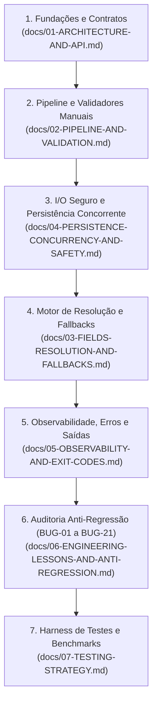

# Índice das Especificações Técnicas — `lib-loghub-ident`

> Este diretório contém as **especificações canônicas, modulares e exaustivas** da biblioteca [`go-loghub-ident`](file:///Users/patrickbrandao/Projects/loghub/go-loghub-ident) (`lib-loghub-ident`).
> O conjunto destes documentos fornece todos os requisitos funcionais, não-funcionais, decisões de design, nomes de objetos, tipos, algoritmos e salvaguardas necessárias para **refatorar ou reimplementar o projeto inteiramente do zero**, preservando 100% de compatibilidade e prevenindo todos os problemas identificados no desenvolvimento.

---

## 1. Mapa de Navegação das Especificações

A documentação está dividida por responsabilidades arquiteturais e domínios de funcionalidade:

| Documento | Tópico Central | Responsabilidades e Conteúdo |
| :--- | :--- | :--- |
| **[`01-ARCHITECTURE-AND-API.md`](file:///Users/patrickbrandao/Projects/loghub/go-loghub-ident/docs/01-ARCHITECTURE-AND-API.md)** | Arquitetura, Concorrência e API Pública | Identidade do módulo, os 6 campos canônicos, API exportada, modelo de concorrência zero-lock (*happens-before*), ciclo de vida com guarda atômica `atomic.Bool` (código 112), abstração da interface `system` e proibição formal do pacote `regexp`. |
| **[`02-PIPELINE-AND-VALIDATION.md`](file:///Users/patrickbrandao/Projects/loghub/go-loghub-ident/docs/02-PIPELINE-AND-VALIDATION.md)** | Higienização e Validadores Manuais | Pipeline universal de saneamento (1ª linha, BOM UTF-8, trim de controles/NUL, lowercase), simetria env-arquivo, e especificação algorítmica de cada validador manual byte a byte (`validMachineID`, `validAgentUUID`, `validAgentName`, `validWorkspace`, `validHostname`, `rootedPath`). |
| **[`03-FIELDS-RESOLUTION-AND-FALLBACKS.md`](file:///Users/patrickbrandao/Projects/loghub/go-loghub-ident/docs/03-FIELDS-RESOLUTION-AND-FALLBACKS.md)** | Resolução dos Campos e Precedência | Matriz exaustiva dos 6 campos (`DATADIR`, `MACHINE_ID`, `AGENT_NAME`, `AGENT_UUID`, `HOSTNAME`, `WORKSPACE`), cadeias de fallbacks em cascata, regras de geração local via UUIDv7 e justificativa da remoção dos códigos 101 e 110. |
| **[`04-PERSISTENCE-CONCURRENCY-AND-SAFETY.md`](file:///Users/patrickbrandao/Projects/loghub/go-loghub-ident/docs/04-PERSISTENCE-CONCURRENCY-AND-SAFETY.md)** | Persistência, Concorrência e Filesystem | Gravação durável (`writeTemp`, `fchmod(0644)`, `fsync` de arquivo e diretório), criação atômica exclusiva via hard link (`CreateExclusive`) e Plano B via trava `.claim` (TTL 10s), estabilização em NFS (`readSettled`), protocolo de regeneração concorrente (`.<arquivo>.regen`), teto de 4 KiB e bloqueio de symlinks (`ReadFileNoFollow`). |
| **[`05-OBSERVABILITY-AND-EXIT-CODES.md`](file:///Users/patrickbrandao/Projects/loghub/go-loghub-ident/docs/05-OBSERVABILITY-AND-EXIT-CODES.md)** | Observabilidade e Códigos de Saída | Modo silencioso padrão, diagnóstico de 6 linhas via `LOGHUB_IDENT_DEBUG`, avisos operacionais compulsórios (`lib-loghub-ident: aviso:`) com hash FNV-1a 64-bit, formato padrão de saída em `stderr` e tabela canônica de códigos de saída (100 a 114). |
| **[`06-ENGINEERING-LESSONS-AND-ANTI-REGRESSION.md`](file:///Users/patrickbrandao/Projects/loghub/go-loghub-ident/docs/06-ENGINEERING-LESSONS-AND-ANTI-REGRESSION.md)** | Catálogo de Lições e Prevenção de Bugs | Registro detalhado de todos os 20 defeitos superados no desenvolvimento (`BUG-01` a `BUG-20`), contexto, armadilhas reais (FIFO, `/dev/zero`, symlinks, umask, corridas) e as 8 Leis Arquiteturais Inegociáveis. |
| **[`07-TESTING-STRATEGY.md`](file:///Users/patrickbrandao/Projects/loghub/go-loghub-ident/docs/07-TESTING-STRATEGY.md)** | Estratégia de Testes e Benchmarks | Metodologia em duas camadas (unitários puros com mock `fakeSystem` vs integração com SO real), harness de subprocessos com `TestMain` e `LOGHUB_IDENT_HELPER=1`, neutralização de `/etc/machine-id`, testes de regressão e benchmarks. |
| **[`08-RELEASE-GUIDE.md`](file:///Users/patrickbrandao/Projects/loghub/go-loghub-ident/docs/08-RELEASE-GUIDE.md)** | Ciclo de Lançamento e Versionamento | Regras do SemVer, imutabilidade de tags no ecossistema Go (`proxy.golang.org`), checklist pré-release e automação via GitHub CLI. |

---

## 2. Roteiro para Refatoração do Zero (Blueprint)

Se for necessário recriar esta biblioteca em Go (ou portá-la para outra linguagem no ecossistema Loghub), siga rigorosamente esta sequência de implementação:

1. **Definição de Tipos e Contratos:** Implemente os tipos de dados básicos, structs privadas e a interface abstrata de I/O `system` ([`01-ARCHITECTURE-AND-API.md`](file:///Users/patrickbrandao/Projects/loghub/go-loghub-ident/docs/01-ARCHITECTURE-AND-API.md)).
2. **Validadores Manuais:** Construa o pipeline de limpeza de texto e as rotinas manuais de inspeção byte a byte, garantindo que o pacote `regexp` não seja importado ([`02-PIPELINE-AND-VALIDATION.md`](file:///Users/patrickbrandao/Projects/loghub/go-loghub-ident/docs/02-PIPELINE-AND-VALIDATION.md)).
3. **Mecanismo de I/O e Filesystem:** Escreva `osSystem` com `CreateExclusive` (hard link + fallback `.claim`), `ReplaceFile` (temp + rename atômico), `fsync` duplo, `fchmod(0644)`, `readSettled` e leitura segura `ReadFileNoFollow` limitada a 4 KiB ([`04-PERSISTENCE-CONCURRENCY-AND-SAFETY.md`](file:///Users/patrickbrandao/Projects/loghub/go-loghub-ident/docs/04-PERSISTENCE-CONCURRENCY-AND-SAFETY.md)).
4. **Motor de Resolução Pura:** Implemente `resolve(sys system) (*identity, *failure)` conectando os 6 campos e seus fallbacks em cascata ([`03-FIELDS-RESOLUTION-AND-FALLBACKS.md`](file:///Users/patrickbrandao/Projects/loghub/go-loghub-ident/docs/03-FIELDS-RESOLUTION-AND-FALLBACKS.md)).
5. **Ciclo de Inicialização:** Escreva `Initialize()` com detecção atômica CAS, geração de diagnósticos debug e terminação imediata via `os.Exit` ([`05-OBSERVABILITY-AND-EXIT-CODES.md`](file:///Users/patrickbrandao/Projects/loghub/go-loghub-ident/docs/05-OBSERVABILITY-AND-EXIT-CODES.md)).
6. **Auditoria de Conformidade:** Compare a implementação com a lista de lições aprendidas e bugs históricos ([`06-ENGINEERING-LESSONS-AND-ANTI-REGRESSION.md`](file:///Users/patrickbrandao/Projects/loghub/go-loghub-ident/docs/06-ENGINEERING-LESSONS-AND-ANTI-REGRESSION.md)).
7. **Bateria de Testes:** Execute os testes unitários isolados com `fakeSystem` e a suíte ponta a ponta com subprocessos ([`07-TESTING-STRATEGY.md`](file:///Users/patrickbrandao/Projects/loghub/go-loghub-ident/docs/07-TESTING-STRATEGY.md)).

---

## 3. Skill de Consumo para Outros Projetos

Para engenheiros ou agentes de IA desenvolvendo microsserviços que precisam consumir a biblioteca, utilize a skill disponível em:
👉 **[`skill/SKILL.md`](file:///Users/patrickbrandao/Projects/loghub/go-loghub-ident/skill/SKILL.md)** — Guia prático de integração, receitas Docker/Kubernetes, configuração de volumes e runbook operacional.
