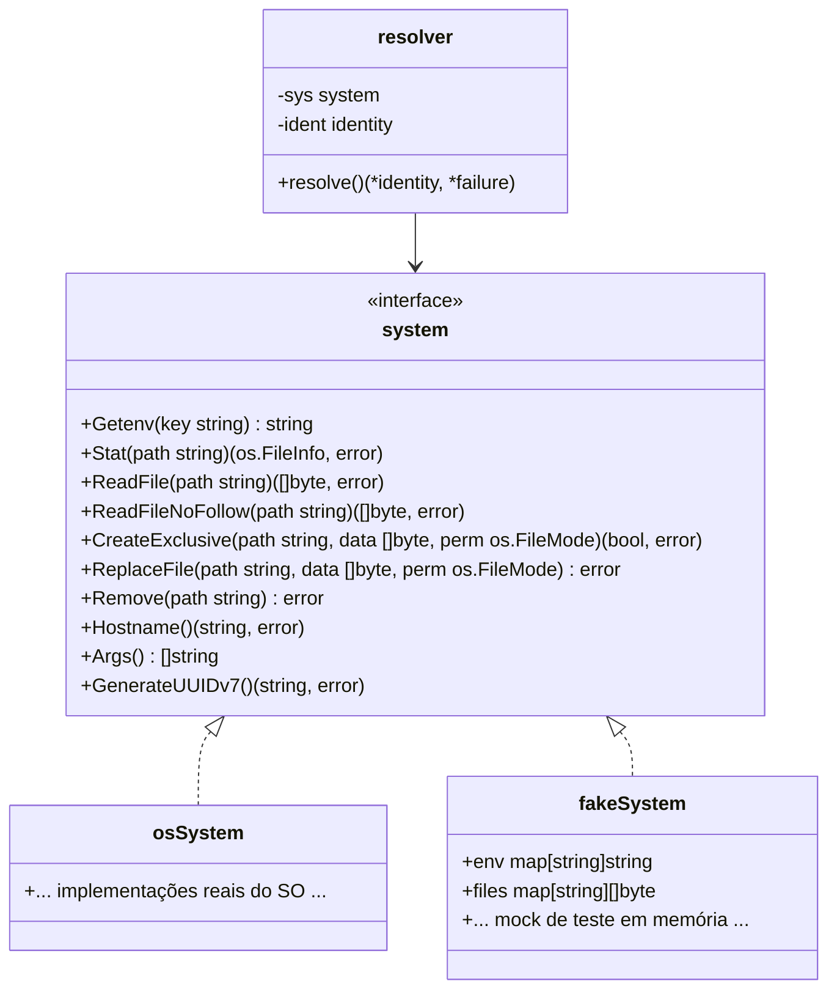

# 01 — Arquitetura do Sistema, Concorrência e API Pública

> **Status:** Canônico e Normativo  
> **Escopo:** Identidade do módulo Go, modelo de concorrência zero-lock, contrato *happens-before*, API pública exportada, interface de abstração de I/O e diretrizes fundamentais de engenharia.

---

## 1. Identidade do Módulo e Dependências

| Item | Valor Canônico | Justificativa / Restrições |
| :--- | :--- | :--- |
| **Módulo Go** | `github.com/patrickbrandao/go-loghub-ident` | Caminho do repositório no GitHub. |
| **Cláusula `package`** | `loghubident` | Nome do pacote Go importável. |
| **Alias Recomendado** | `lhident` | Convenção de importação em projetos consumidores (`import lhident "github.com/patrickbrandao/go-loghub-ident"`). |
| **Versão Mínima de Go** | `go 1.22` | Exigida pelo gerador de UUIDv7 (`go-loghub-uuidv7`). |
| **Dependência Externa Única** | `github.com/patrickbrandao/go-loghub-uuidv7 v0.0.2` | Utilizada exclusivamente para geração local de UUIDv7 canônico (nível 1, precisão de milissegundos). A entropia vem do gerador do runtime do Go (ChaCha8, semeado pelo SO): adequada a identificadores, não a segredos. |

### Convenção de Idiomas
- **Inglês:** Nomes de variáveis, constantes, funções, tipos, structs, métodos, commits de git e branches.
- **Português do Brasil (PT-BR):** Documentação, especificações técnicas, comentários de código, mensagens de erro em `stderr` e diagnósticos operacionais.

---

## 2. Os Seis Campos Canônicos de Identidade

A biblioteca tem como propósito único resolver, fixar e expor seis atributos fundamentais que identificam um processo no ecossistema Loghub:

1. **`DataDir` (`string`):** Caminho absoluto no filesystem local para armazenamento persistente de dados e chaves da aplicação e da própria biblioteca (padrão `/data`).
2. **`MachineID` (`string`):** Identificador de 32 caracteres hexadecimais em lowercase (sem hífens), representativo da máquina física, nó virtual ou instância de computação.
3. **`AgentName` (`string`):** Nome lógico do serviço ou microsserviço (máx. 64 caracteres, seguro contra path traversal).
4. **`AgentUUID` (`string`):** UUIDv7 canônico (36 caracteres com hífens, versão 7, variante RFC 9562), ordenável temporalmente, identificando a instância específica do agente.
5. **`Hostname` (`string`):** Nome de host do sistema, validado segundo os padrões estritos da RFC 1123 (máx. 253 caracteres, rótulos alfanuméricos de 1 a 63 chars sem hífens nas extremidades).
6. **`Workspace` (`string`):** Identificador do tenant ou ambiente lógico ao qual o agente pertence (máx. 64 caracteres, padrão `"default"`).

---

## 3. API Pública Exportada

A biblioteca expõe exclusivamente funções e constantes. A estrutura interna de armazenamento de dados é rigorosamente privada para garantir imutabilidade e thread-safety absolutos.

```go
package loghubident

// Constantes públicas de configuração padrão
const (
    DefaultDataDir       = "/data"
    DefaultMachineIDFile = "/etc/machine-id"
    DefaultWorkspace     = "default"
    EnvDebug             = "LOGHUB_IDENT_DEBUG"
)

// Função de inicialização compulsória (executada uma única vez no início do processo)
func Initialize()

// Consulta do estado de inicialização
func IsInitialized() bool

// Getters públicos (retornos do tipo string, imutáveis)
func DataDir() string
func MachineID() string
func AgentName() string
func AgentUUID() string
func Hostname() string
func Workspace() string
```

### Contrato dos Getters
- **Retorno antes de `Initialize()`:** Devolvem string vazia (`""` - zero value).
- **Complexidade de Leitura:** $O(1)$ estrito. Trata-se de uma leitura direta de variável de pacote na memória.
- **Zero Locks:** Nenhuma chamada a getter utiliza mutex (`sync.Mutex`, `sync.RWMutex`), canais ou operações atômicas. Podem ser invocadas concorrentemente por centenas de goroutines com custo inferior a 1 nanossegundo por operação.

---

## 4. Modelo de Concorrência e Ciclo de Vida

### Contrato *Happens-Before*
A biblioteca opera sob o modelo de **inicialização antecipada imutável**:
1. `Initialize()` DEVE ser invocada na goroutine principal (`main()`), antes de qualquer goroutine de trabalho ser criada.
2. A criação de goroutines pelo runtime de Go estabelece uma barreira de memória (*happens-before*). Toda a escrita ocorrida em `Initialize()` torna-se visível de forma imediata e consistente para qualquer goroutine subsequente sem necessidade de sincronização.
3. Após o retorno de `Initialize()`, os dados em memória tornam-se estritamente **read-only** durante todo o ciclo de vida do processo.

### Guarda de Execução Única e Encerramento (Exit 112)
Para impedir corridas acidentais ou chamadas concorrentes a `Initialize()`, a biblioteca utiliza um `atomic.Bool`:

```go
var initialized atomic.Bool

func Initialize() {
    if !initialized.CompareAndSwap(false, true) {
        fmt.Fprintf(os.Stderr, "lib-loghub-ident: geral: Initialize() já foi chamado\n")
        os.Exit(112)
    }
    // ... resolução dos campos ...
}
```

- Se `CompareAndSwap(false, true)` falhar, o processo é abortado imediatamente com **código de saída 112**.
- A biblioteca não tenta se recuperar nem ignora a segunda chamada: uma chamada dupla sinaliza um erro grave de arquitetura do consumidor.

---

## 5. Arquitetura Interna e Testabilidade

Para permitir testes unitários determinísticos em memória sem tocar no sistema operacional real ou encerrar o processo, a arquitetura separa estritamente o **motor de resolução pura** da **camada de I/O**:



### 1. Interface de Abstração `system` (`system.go`)
Define todas as primitivas de contato com o ambiente operacional:
- `Getenv(key string) string`: Consulta variáveis de ambiente.
- `Stat(path string) (os.FileInfo, error)`: Consulta metadados de arquivo.
- `ReadFile(path string) ([]byte, error)`: Leitura de arquivos regulares com teto rígido de 4 KiB.
- `ReadFileNoFollow(path string) ([]byte, error)`: Leitura segura que recusa symlinks em `$DATADIR`.
- `CreateExclusive(path string, data []byte, perm os.FileMode) (bool, error)`: Gravação atômica exclusiva (hard link com fallback `.claim`).
- `ReplaceFile(path string, data []byte, perm os.FileMode) error`: Substituição atômica via arquivo temporário + rename.
- `Remove(path string) error`: Exclusão de arquivo.
- `Hostname() (string, error)`: Consulta do nome do host.
- `Args() []string`: Leitura dos argumentos do processo (`os.Args`).
- `GenerateUUIDv7() (string, error)`: Geração criptográfica de UUIDv7.

### 2. Estrutura de Falha `failure`
Quando a resolução falha, a função pura não executa `os.Exit`. Ela retorna um ponteiro para `failure`:
```go
type failure struct {
    code     int
    variable string
    reason   string
}
```

### 3. Função Pura de Resolução `resolve` (`resolve.go`)
```go
func resolve(sys system) (*identity, *failure)
```
- Recebe a interface `system` injetada.
- Retorna os campos resolvidos ou a estrutura de falha com código numérico e diagnóstico descritivo.
- `Initialize()` atua apenas como coordenador: invoca `resolve(osSystem{})`, define as variáveis globais imutáveis em caso de sucesso ou emite os logs e executa `os.Exit(f.code)` em falha.

---

## 6. Proibição Formal do Pacote `regexp`

Por decisão deliberada de engenharia e otimização:
> **É EXPRESSAMENTE PROIBIDO IMPORTAR O PACOTE `"regexp"` NA BIBLIOTECA.**

### Justificativas Técnicas:
1. **Pegada de Binário (Binary Footprint):** A inclusão de `regexp` adiciona ~379 KB de código ao binário final de qualquer aplicação compilada que importe a biblioteca.
2. **Tempo e Alocações no Boot:** A inicialização do compilador de expressões regulares do Go consome ~11,6 µs e realiza ~355 alocações de memória heap antes mesmo de qualquer chamada de função.
3. **Limitações Estruturais de Regex:** Expressões regulares puras não conseguem validar sem complexidade desproporcional regras essenciais de segurança, como limites máximos de caracteres em rótulos RFC 1123, restrições a hífens nas extremidades e rejeição a componentes de path traversal (`.` e `..`).
4. **Substituição por Loops Manuais:** A biblioteca implementa validadores manuais byte a byte em [`02-PIPELINE-AND-VALIDATION.md`](file:///Users/patrickbrandao/Projects/loghub/go-loghub-ident/docs/02-PIPELINE-AND-VALIDATION.md). A verificação manual é centenas de vezes mais rápida, possui zero alocações na heap e é totalmente imune a ataques de ReDoS.
