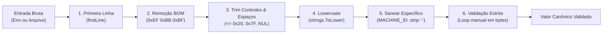

# 02 — Pipeline de Higienização e Validadores Manuais

> **Status:** Canônico e Normativo  
> **Escopo:** Pipeline unificado de saneamento de strings, simetria entre variáveis de ambiente e arquivos, especificação algorítmica de validadores manuais byte a byte e salvaguardas contra *path traversal* e corrupção silenciosa.

---

## 1. O Pipeline Universal de Higienização

Toda entrada textual processada pela biblioteca — seja lida de uma variável de ambiente do processo ou extraída de um arquivo de configuração/disco — DEVE passar pelo **mesmo pipeline de 6 etapas**, implementado em [`resolve.go`](file:///Users/patrickbrandao/Projects/loghub/go-loghub-ident/resolve.go).



### Detalhamento das Etapas:

1. **Extração da Primeira Linha (`firstLine`):**
   - O processamento consome caracteres somente até o primeiro caractere de quebra de linha (`\r` ou `\n`). Qualquer dado após a quebra é descartado.
2. **Remoção de Byte Order Mark (BOM UTF-8):**
   - Remove o prefixo `0xEF, 0xBB, 0xBF` (`\ufeff`), frequentemente inserido por editores no Windows (como o Notepad) ao editar arquivos de configuração.
3. **Trim de Espaços e Caracteres de Controle:**
   - Remove espaços e caracteres de controle Unicode nas bordas (`unicode.IsSpace` e `unicode.IsControl`: tudo `<= 0x20`, o `0x7f`, os controles C1 e os espaços Unicode como NBSP).
   - **Crucial:** O trim elimina bytes `NUL` (`0x00`). Um processo interrompido por queda de energia ou *kernel panic* pode deixar blocos nulos parciais no disco. O trim evita que bytes nulos residuais reprovem um valor legítimo.
4. **Conversão Compulsória para Lowercase:**
   - Todo identificador é convertido para minúsculas (`strings.ToLower`). Nomes em caixa alta ou mista são normalizados automaticamente.
5. **Higienização Específica por Campo:**
   - **`MACHINE_ID`:** Remove todos os hífens (`strings.ReplaceAll(s, "-", "")`) para permitir a interoperabilidade com formatos legados ou formatações formatadas como UUID.
   - **Demais campos:** Nenhum outro caractere é removido. Qualquer caractere não permitido deve reprovar na validação estrita.
6. **Validação Manual Estrita:**
   - Submissão da string resultante ao validador manual byte a byte correspondente.

### Regra de Simetria Obrigatória (Env vs Arquivo)
Conforme fixado no **`BUG-14`**, o pipeline DEVE ser rigorosamente idêntico para variáveis de ambiente e arquivos. É proibido aplicar `firstLine` apenas em arquivos. Uma variável de ambiente contendo quebras de linha (`MACHINE_ID="abc\ndef"`) deve ter sua primeira linha extraída exatamente como um arquivo físico.

---

## 2. Validação Manual Byte a Byte (Sem `regexp`)

Todas as funções de validação operam inspecionando bytes brutos em loops simples, garantindo alocação zero de memória heap, tempo de execução previsível e imunidade total a vulnerabilidades de ReDoS.

### 2.1. Validador de `MACHINE_ID` (`validMachineID`)

O identificador de máquina deve ser uma sequência contínua de exatamente 32 dígitos hexadecimais em minúsculo:

```go
func validMachineID(s string) bool {
    if len(s) != 32 {
        return false
    }
    for i := 0; i < len(s); i++ {
        c := s[i]
        if !((c >= '0' && c <= '9') || (c >= 'a' && c <= 'f')) {
            return false
        }
    }
    return true
}
```

- **Expressão regular equivalente:** `^[0-9a-f]{32}$`
- **Comprimento exato:** 32 bytes.
- **Caracteres permitidos:** `0-9`, `a-f`.

---

### 2.2. Validador de `AGENT_UUID` (`validAgentUUID`)

O UUID do agente deve atender estritamente ao padrão **UUIDv7 canônico RFC 9562** com hífens nos delimitadores de grupo:

```go
func validAgentUUID(s string) bool {
    if len(s) != 36 {
        return false
    }
    for i := 0; i < len(s); i++ {
        c := s[i]
        switch i {
        case 8, 13, 18, 23:
            if c != '-' {
                return false
            }
        case 14:
            // Versão 7 obrigatória
            if c != '7' {
                return false
            }
        case 19:
            // Variante RFC 9562 / RFC 4122: bits 10xx (8, 9, a, b)
            if c != '8' && c != '9' && c != 'a' && c != 'b' {
                return false
            }
        default:
            if !((c >= '0' && c <= '9') || (c >= 'a' && c <= 'f')) {
                return false
            }
        }
    }
    return true
}
```

- **Expressão regular equivalente:** `^[0-9a-f]{8}-[0-9a-f]{4}-7[0-9a-f]{3}-[89ab][0-9a-f]{3}-[0-9a-f]{12}$`
- **Comprimento exato:** 36 bytes.
- **Posições fixas:** Hífens em 8, 13, 18, 23. Dígito de versão `'7'` no índice 14. Dígito de variante `'8'`, `'9'`, `'a'` ou `'b'` no índice 19.

---

### 2.3. Validador de `AGENT_NAME` (`validAgentName`)

O nome do agente identifica o serviço no ecossistema e é frequentemente utilizado para formar nomes de arquivos, diretórios e chaves de índice.

```go
func validAgentName(s string) bool {
    if len(s) < 1 || len(s) > 64 {
        return false
    }
    // Proteção estrita contra Path Traversal (BUG-06)
    if s == "." || s == ".." {
        return false
    }
    for i := 0; i < len(s); i++ {
        c := s[i]
        if !((c >= 'a' && c <= 'z') || (c >= '0' && c <= '9') || c == '.' || c == '_' || c == '-') {
            return false
        }
    }
    return true
}
```

- **Expressão regular equivalente:** `^[a-z0-9._-]+$`
- **Comprimento:** Mínimo 1 byte, máximo 64 bytes.
- **Caracteres permitidos:** `a-z`, `0-9`, `.`, `_`, `-`.
- **Rejeição explícita de travessia:** Recusa terminantemente `"."` e `".."` para evitar ataques quando o consumidor utiliza `filepath.Join(baseDir, AgentName())`.

---

### 2.4. Validador de `WORKSPACE` (`validWorkspace`)

O workspace delimita o tenant ou ambiente lógico. Possui regras análogas ao `AGENT_NAME`, exceto pelo caractere sublinhado (`_`), que **não é permitido**:

```go
func validWorkspace(s string) bool {
    if len(s) < 1 || len(s) > 64 {
        return false
    }
    // Proteção estrita contra Path Traversal (BUG-06)
    if s == "." || s == ".." {
        return false
    }
    for i := 0; i < len(s); i++ {
        c := s[i]
        if !((c >= 'a' && c <= 'z') || (c >= '0' && c <= '9') || c == '.' || c == '-') {
            return false
        }
    }
    return true
}
```

- **Expressão regular equivalente:** `^[a-z0-9.-]+$`
- **Comprimento:** Mínimo 1 byte, máximo 64 bytes.
- **Caracteres permitidos:** `a-z`, `0-9`, `.`, `-`.
- **Rejeição explícita:** Recusa `"."` e `".."` e **não aceita `_`**.

---

### 2.5. Validador de `HOSTNAME` (`validHostname`)

O hostname deve obedecer aos requisitos da **RFC 1123** (seção 2.1) e **RFC 952**:

```go
func validHostname(s string) bool {
    if len(s) < 1 || len(s) > 253 {
        return false
    }

    start := 0
    for start < len(s) {
        end := start
        for end < len(s) && s[end] != '.' {
            end++
        }

        labelLen := end - start
        if labelLen < 1 || labelLen > 63 {
            return false
        }

        // Primeiro e último caractere do rótulo não podem ser hífen
        if s[start] == '-' || s[end-1] == '-' {
            return false
        }

        for i := start; i < end; i++ {
            c := s[i]
            if !((c >= 'a' && c <= 'z') || (c >= '0' && c <= '9') || c == '-') {
                return false
            }
        }

        start = end + 1
    }

    // Não pode terminar com ponto (rótulo vazio no final)
    if s[len(s)-1] == '.' {
        return false
    }

    return true
}
```

- **Comprimento total:** Mínimo 1 caractere, máximo 253 caracteres.
- **Estrutura de rótulos (labels):** Separados por `.` (ponto). Cada rótulo deve ter entre 1 e 63 caracteres.
- **Restrição de extremidades:** Nenhum rótulo pode iniciar ou terminar com hífen (`-`).
- **Caracteres permitidos em rótulos:** `a-z`, `0-9`, `-`.
- **Valores degenerados rejeitados:** `-`, `...`, `-node-`, `node..com`, `.node`.

---

### 2.6. Validadores de Caminho (`hasControlBytes` e `rootedPath`)

Utilizados, nesta ordem, para validar `DATADIR` e `MACHINE_ID_FILE` informados pelo usuário (`resolve.go`):

```go
// hasControlBytes recusa C0 (< 0x20), DEL (0x7f) e C1 (U+0080 a U+009F).
// Bytes que não formam UTF-8 válido não são controle e passam: em Unix um
// caminho é uma sequência de bytes qualquer. Não aloca.
func hasControlBytes(s string) bool {
    for _, c := range s {
        if unicode.IsControl(c) {
            return true
        }
    }
    return false
}

// rootedPath informa se o caminho está ancorado na raiz, ou seja, se NÃO
// varia com o diretório de trabalho do processo. filepath.IsAbs sozinho não
// serve: em Windows ele recusa "/data", o próprio DefaultDataDir.
func rootedPath(p string) bool {
    if filepath.IsAbs(p) {
        return true
    }
    return p != "" && (p[0] == '/' || p[0] == os.PathSeparator)
}
```

- **Controles (BUG-24):** Qualquer caractere de controle Unicode — C0, DEL ou C1 — aborta com código de saída 100. O predicado é `unicode.IsControl` por runa; espaços (inclusive NBSP) são aceitos, porque caminhos com espaço são legítimos.
- **Regra de ancoragem:** O caminho DEVE estar ancorado na raiz do filesystem.
- **Unix:** Inicia obrigatoriamente com `/`.
- **Windows:** Inicia com `\` ou `/` (ancorado na unidade corrente) ou com letra de unidade (`C:\`, aceita por `filepath.IsAbs`).
- **Recusa:** Caminhos relativos (`data`, `./data`, `../data`, `C:data`) são terminantemente recusados com código de saída 100 (**BUG-10**).
- **Normalização com `filepath.Clean`:** Caminhos com barras duplas (`/data//`) ou referências relativas normalizáveis (`/data/./dir`) são limpos antes do uso (**BUG-13**).
