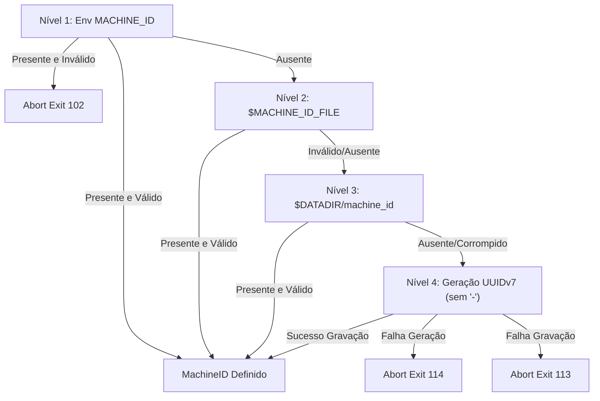

# 03 — Resolução dos Campos e Cadeias de Fallback

> **Status:** Canônico e Normativo  
> **Escopo:** Cadeias de resolução em cascata dos 6 campos, precedências estritas, comportamento em ausência vs invalidez, geração local determinística e fundamentação de códigos de erro.

---

## 1. Visão Geral da Matriz de Resolução

| Campo | Variável de Ambiente | Precedência 1 (Env) | Precedência 2 (Arquivo de Host) | Precedência 3 (Volume Persistente) | Precedência 4 (Fallback / Geração) | Persiste em `$DATADIR`? | Códigos de Erro Possíveis |
| :--- | :--- | :--- | :--- | :--- | :--- | :---: | :--- |
| **`DATADIR`** | `DATADIR` | Caminho explícito | — | — | Padrão: `/data` | **Não** (diretório raiz) | **100** |
| **`MACHINE_ID`** | `MACHINE_ID` | 32 hex (sem `-`) | `$MACHINE_ID_FILE` (padrão `/etc/machine-id`) | `$DATADIR/machine_id` | Geração local UUIDv7 (sem `-`) | **Sim** (somente se gerado) | **100**, **102**, **113**, **114** |
| **`AGENT_NAME`** | `AGENT_NAME` | Nome do serviço | — | `$DATADIR/agent_name` | `argv[0]` do binário (sem `.exe`) | **Não** (determinístico) | **103**, **104** |
| **`AGENT_UUID`** | `AGENT_UUID` | UUIDv7 canônico | — | `$DATADIR/agent_uuid` | Geração local UUIDv7 canônico | **Sim** (somente se gerado) | **105**, **106**, **107** |
| **`HOSTNAME`** | `HOSTNAME` | Hostname RFC 1123 | Chamada `os.Hostname()` | — | — | **Não** (volátil do nó) | **108**, **109** |
| **`WORKSPACE`** | `WORKSPACE` | Nome do workspace | — | `$DATADIR/workspace` | Padrão fixo: `"default"` | **Não** (determinístico) | **111** |

---

## 2. Princípio da Ausência vs. Invalidez

O motor de resolução adota uma distinção fundamental de segurança e previsibilidade:

1. **Fonte Ausente ou Vazia:**
   - Se uma variável de ambiente não existe, ou se seu valor após o pipeline de higienização for vazio (`""`), a biblioteca **não falha**: ela segue imediatamente para a próxima fonte da cadeia de precedência.
2. **Fonte de Configuração Presente porém Inválida:**
   - Se o operador configurou explicitamente uma variável de ambiente (`MACHINE_ID`, `AGENT_NAME`, `AGENT_UUID`, `HOSTNAME`, `WORKSPACE`) ou um arquivo estático (`agent_name`, `workspace`), e o valor não atende ao formato canônico, **a biblioteca aborta imediatamente com o código de saída específico**.
   - *Racional:* Entregar silenciosamente uma identidade gerada quando o operador passou uma configuração corrompida causaria desastres em produção (duplicação de nós, partição de dados e falhas de licenciamento).
3. **Exceção de Arquivos Auto-Geridos (`machine_id` e `agent_uuid` em `$DATADIR`):**
   - Se um arquivo gerenciado pela própria biblioteca contiver dados corrompidos (por queda de energia ou truncate), a biblioteca **emite aviso compulsório em `stderr`** e aciona o protocolo concorrente de regeneração ([`04-PERSISTENCE-CONCURRENCY-AND-SAFETY.md`](file:///Users/patrickbrandao/Projects/loghub/go-loghub-ident/docs/04-PERSISTENCE-CONCURRENCY-AND-SAFETY.md)).

---

## 3. Especificação Detalhada por Campo

### 3.1. `DATADIR` — Diretório de Dados

- **Variável de Ambiente:** `DATADIR`
- **Valor Padrão:** `/data` (`DefaultDataDir`)
- **Regras:**
  1. O caminho deve ser válido segundo `rootedPath` (ancorado na raiz). Caminhos relativos (`dados`, `./dados`) abortam imediatamente com **código 100** e variável `DATADIR` (**BUG-10**).
  2. O caminho é normalizado por `filepath.Clean` (**BUG-13**).
  3. **Validação Preguiçosa (Lazy):** A biblioteca **não verifica** se `$DATADIR` existe no boot se nenhuma operação de leitura ou gravação em disco for necessária. Em ambientes com todas as variáveis fornecidas via env, o disco nunca é tocado (suporte total a containers read-only).
  4. **Comportamento na Leitura:** Se `$DATADIR` não existir (`fs.ErrNotExist`), ele é tratado como *fonte ausente*, permitindo que campos com fallbacks determinísticos (`AGENT_NAME` via `argv[0]` e `WORKSPACE` via `"default"`) completem o boot com sucesso (**BUG-02**). Qualquer outro erro de `Stat` (como falta de permissão) aborta com **código 100**.
  5. **Comportamento na Gravação:** Se a biblioteca precisar persistir uma identidade gerada (`machine_id` ou `agent_uuid`) e `$DATADIR` não existir, não for diretório ou recusar permissão, aborta com **código 100**. A biblioteca **nunca cria** o diretório `$DATADIR` (essa responsabilidade é do orquestrador).
  6. **Links Simbólicos:** Symlinks em `$DATADIR` são recusados por segurança com **código 100** (**BUG-18**).

---

### 3.2. `MACHINE_ID` — Identificador do Nó/Host

- **Formato Canônico:** 32 caracteres hexadecimais `0-9a-f`, sem hífens.
- **Cadeia de Resolução (4 Níveis):**

1. **Nível 1 (Env `MACHINE_ID`):**
   - Hífens são removidos e a string é convertida para minúsculas.
   - Se presente e inválida: aborta com **código 102**.
2. **Nível 2 (Arquivo `$MACHINE_ID_FILE`):**
   - Padrão do sistema operacional: `/etc/machine-id` (`DefaultMachineIDFile`).
   - Se `$MACHINE_ID_FILE` for definido explicitamente pelo operador via env:
     - Caminho relativo ou com caracteres de controle: aborta com **código 100** e variável `MACHINE_ID_FILE`.
     - Inexistente (`fs.ErrNotExist`): comuta automaticamente para o padrão `/etc/machine-id`.
     - Inacessível por erro de I/O/permissão ou inutilizável (FIFO, socket, dispositivo, diretório ou tamanho > 4 KiB): aborta com **código 100** e variável `MACHINE_ID_FILE` (**BUG-01**, **BUG-15**, **BUG-19**).
   - Se for o `/etc/machine-id` padrão: leitura best-effort. Caso inexistente, ilegível ou com conteúdo inválido, segue silenciosamente para o Nível 3.
3. **Nível 3 (Arquivo `$DATADIR/machine_id`):**
   - Lido via `ReadFileNoFollow`. Se contiver dados inválidos, emite aviso compulsório em `stderr` com tamanho e hash FNV-1a (**BUG-03**) e cai para o Nível 4.
4. **Nível 4 (Geração Local):**
   - Invoca `sys.GenerateUUIDv7()`.
   - Remove os hífens gerando 32 caracteres hexadecimais.
   - Persiste em `$DATADIR/machine_id` com permissão `0644` e `fsync` duplo via `persistGenerated` ([`04-PERSISTENCE-CONCURRENCY-AND-SAFETY.md`](file:///Users/patrickbrandao/Projects/loghub/go-loghub-ident/docs/04-PERSISTENCE-CONCURRENCY-AND-SAFETY.md)).
   - Falha interna de geração de UUID: aborta com **código 114**.
   - Falha de escrita no disco: aborta com **código 113**.

---

### 3.3. `AGENT_NAME` — Nome do Agente/Serviço

- **Formato Canônico:** 1 a 64 bytes, `[a-z0-9._-]`, recusando expressamente `.` e `..`.
- **Cadeia de Resolução (3 Níveis):**

1. **Nível 1 (Env `AGENT_NAME`):**
   - Se presente e inválida (tamanho > 64, caracteres inválidos ou `.` / `..`): aborta com **código 104**.
2. **Nível 2 (Arquivo `$DATADIR/agent_name`):**
   - Lido via `ReadFileNoFollow`. Se presente e inválido: aborta com **código 104**.
3. **Nível 3 (Fallback Determinístico `argv[0]`):**
   - Obtém `sys.Args()[0]`.
   - Extrai o nome base com `filepath.Base`.
   - Converte para lowercase.
   - Remove o sufixo `.exe` (mantendo eventuais outros pontos).
   - Se o resultado saneado for vazio, `"."` ou o separador de caminhos do sistema operacional: aborta com **código 103**.
   - Se o resultado reprovar no validador `validAgentName`: aborta com **código 104**.
   - **Importante:** Fallbacks determinísticos nunca gravam arquivos no disco.

---

### 3.4. `AGENT_UUID` — Identificador Único do Agente

- **Formato Canônico:** UUIDv7 canônico de 36 caracteres com hífens (`^[0-9a-f]{8}-[0-9a-f]{4}-7[0-9a-f]{3}-[89ab][0-9a-f]{3}-[0-9a-f]{12}$`).
- **Cadeia de Resolução (3 Níveis):**

1. **Nível 1 (Env `AGENT_UUID`):**
   - Não remove hífens. Aplica apenas trim e lowercase.
   - Se presente e inválida: aborta com **código 107**.
2. **Nível 2 (Arquivo `$DATADIR/agent_uuid`):**
   - Lido via `ReadFileNoFollow`.
   - Se inexistente ou com formato inválido: emite aviso operacional compulsório em `stderr` e segue para o Nível 3.
3. **Nível 3 (Geração Local):**
   - Invoca `sys.GenerateUUIDv7()`.
   - Valida conformidade estrita com a RFC 9562 (`validAgentUUID`).
   - Persiste em `$DATADIR/agent_uuid` com permissão `0644` e `fsync` via `persistGenerated`.
   - Falha interna na geração de UUID: aborta com **código 105**.
   - Falha de gravação no disco: aborta com **código 106**.
   - Valor gerado inválido: aborta com **código 107**.

---

### 3.5. `HOSTNAME` — Nome de Host do Sistema

- **Formato Canônico:** RFC 1123 (1 a 253 caracteres, rótulos de 1 a 63 chars sem hífens nas bordas).
- **Cadeia de Resolução (2 Níveis):**

1. **Nível 1 (Env `HOSTNAME`):**
   - Se presente e inválida segundo `validHostname`: aborta com **código 109**.
2. **Nível 2 (Chamada do SO `sys.Hostname()`):**
   - Se a syscall retornar erro: aborta com **código 108**.
   - Se o valor retornado for inválido segundo a RFC 1123: aborta com **código 109**.
   - Hostname nunca é salvo em disco.

---

### 3.6. `WORKSPACE` — Tenant / Ambiente Lógico

- **Formato Canônico:** 1 a 64 bytes, `[a-z0-9.-]`, recusando expressamente `.` e `..` e o caractere `_`.
- **Cadeia de Resolução (3 Níveis):**

1. **Nível 1 (Env `WORKSPACE`):**
   - Se presente e inválida: aborta com **código 111**.
2. **Nível 2 (Arquivo `$DATADIR/workspace`):**
   - Lido via `ReadFileNoFollow`. Se presente e inválido: aborta com **código 111**.
3. **Nível 3 (Fallback Fixo):**
   - Devolve a constante `"default"` (`DefaultWorkspace`). Nunca grava em disco.

---

## 4. Racional dos Códigos de Erro Removidos e Adicionados

### Eliminação dos Códigos 101 e 110:
- **Código 101 (Originalmente ausência de `MACHINE_ID`):** Foi eliminado porque a cadeia de machine-id sempre culmina em geração automática local de UUIDv7. O campo nunca falha por ausência.
- **Código 110 (Originalmente ausência de `WORKSPACE`):** Foi eliminado porque o workspace possui o fallback infalível `"default"`.

### Adição do Código 114:
- O código **105** é reservado exclusivamente para falha de geração do `AGENT_UUID`.
- Se a biblioteca usasse 105 para a geração do `MACHINE_ID`, o operador receberia em `stderr` uma mensagem ambígua acusando erro no campo errado. Criou-se o código **114** exclusivamente para indicar falha de geração de UUID na composição do `MACHINE_ID`.
