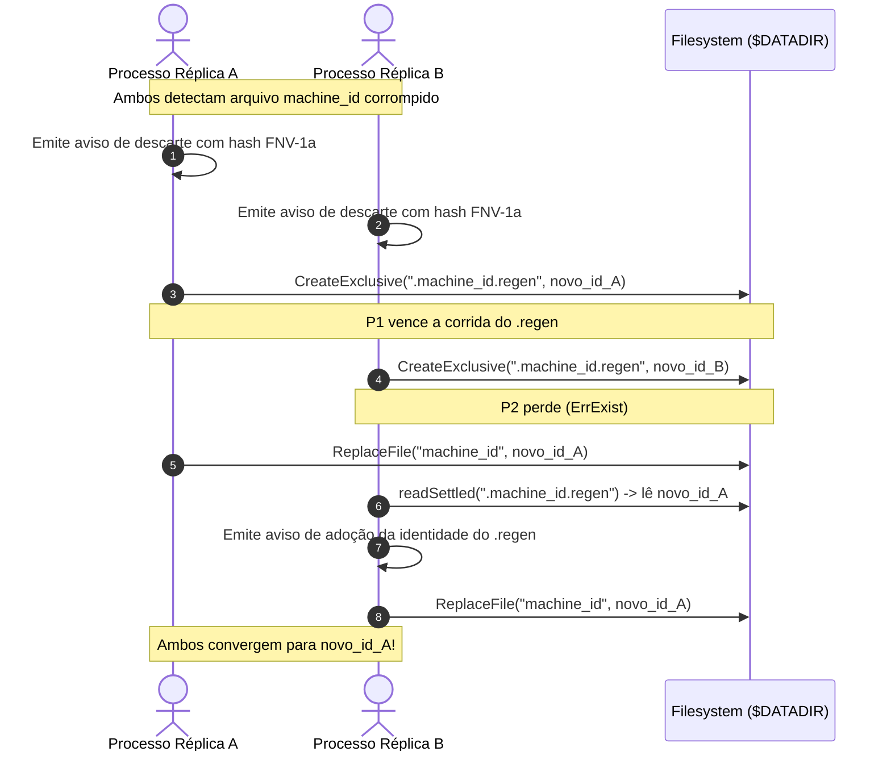

# 04 — Persistência, Concorrência e Filesystem Seguro

> **Status:** Canônico e Normativo  
> **Escopo:** Layout de arquivos em `$DATADIR`, garantias de gravação durável (`fsync`), criação atômica exclusiva (`CreateExclusive`), Plano B com trava `.claim`, estabilização em NFS (`readSettled`), protocolo de arbitragem de corrupção (`.regen`), defesas contra FIFO/symlinks e teto de 4 KiB.

---

## 1. Layout de Arquivos em `$DATADIR`

O diretório persistente de dados armazena os seguintes arquivos gerenciados e monitorados pela biblioteca:

```text
$DATADIR/
├── machine_id           # 32 hexadecimais (0644) — gerado ou lido
├── agent_uuid           # UUIDv7 canônico (0644) — gerado ou lido
├── agent_name           # Nome do agente (opcional, somente leitura pela lib)
├── workspace            # Nome do workspace (opcional, somente leitura pela lib)
├── .machine_id.regen    # Registro oculto de arbitragem de regeneração
├── .agent_uuid.regen    # Registro oculto de arbitragem de regeneração
└── .<name>.claim        # Arquivo de trava temporária para filesystems sem hard link
```

### Regras de Permissão e Umask
- Todo arquivo persistido pela biblioteca recebe permissão explícita `0644` (`-rw-r--r--`).
- **Defesa contra Umask Restritivo (`BUG-05`):** Ambientes Docker e Kubernetes corporativos frequentemente aplicam `umask 0077` ou `0027`. Uma chamada padrão a `os.Create` ou `os.WriteFile` resultaria em arquivos `0600`, impedindo que sidecars rodando com outro UID pudessem ler a identidade. A biblioteca executa `fchmod(0644)` explícito no descritor de arquivo antes de publicá-lo.

---

## 2. Gravação Durável com `fsync` Duplo

Para impedir corrupção por queda abrupta de energia (*crash*, `kill -9` ou reinício de host), a biblioteca implementa `writeTemp` com sincronização completa de metadados e blocos (**`BUG-17`**):

1. **Criação do Arquivo Temporário:** Cria um arquivo temporário no **mesmo diretório** do destino (`os.CreateTemp(dir, ".ident-tmp-*.tmp")`), assegurando que temporário e destino residam no mesmo filesystem.
2. **Escrita do Conteúdo:** Escreve os bytes brutos da identidade sanitizada.
3. **Imposição de Permissões:** Executa `f.Chmod(perm)` diretamente sobre o descritor aberto.
4. **Fsync do Arquivo:** Invoca `f.Sync()` antes de fechar o arquivo, descarregando as páginas de cache do kernel para o disco físico.
5. **Fechamento Seguro:** Executa `f.Close()`.
6. **Fsync do Diretório:** Após publicar o arquivo (seja por `os.Link` ou `os.Rename`), a biblioteca abre o diretório pai em modo read-only e executa `dir.Sync()`. Isso garante a persistência dos metadados da entrada de diretório na tabela do filesystem.

---

## 3. Criação Atômica Exclusiva (`CreateExclusive`)

Quando múltiplos processos irmãos inicializam simultaneamente competindo pelo mesmo volume (ex.: container principal e sidecars em um mesmo Pod Kubernetes), a criação da identidade a frio utiliza o filesystem como árbitro de exclusão mútua (**`BUG-04`**):

```mermaid
flowchart TD
    Start["Início da Criação"] --> WT["Gravar temporário com fsync duplo"]
    WT --> Link["Tentar os.Link(tmp, target)"]
    Link -->|Sucesso| Win["Vencedor! Remove tmp, faz syncDir e conclui"]
    Link -->|ErrExist| Loser["Perdedor! Remove tmp e aguarda readSettled()"]
    Link -->|Erro de Hard Link<br>(EXDEV, ENOTSUP, Windows)| PlanB["Acionar Plano B: createExclusiveDirect via .claim"]
```

### 3.1. Mecanismo Primário: `os.Link` (Hard Link)
- A biblioteca tenta criar um link rígido do arquivo temporário apontando para o nome definitivo (`machine_id` ou `agent_uuid`).
- A chamada de sistema `link()` é atômica no nível do kernel:
  - **Vencedor (`err == nil`):** O arquivo foi criado com sucesso. O temporário é removido e o diretório pai recebe `fsync`. Retorna `(true, nil)`.
  - **Perdedor (`os.IsExist(err)`):** Outro processo concluiu a criação milissegundos antes. O processo remove seu temporário, entra em [`readSettled`](#4-estabilização-em-nfs-e-leitura-estabilizada-readsettled) e adota o valor gravado pelo vencedor. Retorna `(false, nil)`.

### 3.2. Mecanismo de Plano B: Trava `.claim` com TTL (`createExclusiveDirect`)
Em filesystems onde hard links não são suportados (como montagens CIFS, certos compartilhamentos virtuais ou Windows):
1. A biblioteca detecta o erro de suporte a hard link e comuta para `createExclusiveDirect`.
2. Tenta criar um arquivo de trava exclusivo: `$DATADIR/.<arquivo>.claim`.
3. O `.claim` contém o PID do processo e um timestamp de criação.
4. **Proteção contra Deadlock (TTL de 10s):** Se o arquivo `.claim` já existir, a biblioteca verifica seu tempo de modificação (`ModTime`). Se for mais antigo que 10 segundos (sinal de processo morto antes de concluir), a trava expirada é removida e a criação prossegue.
5. O vencedor publica o arquivo final via `os.Rename(tmp, target)` de forma atômica.

---

## 4. Estabilização em NFS e Leitura Estabilizada (`readSettled`)

Em volumes de rede (como NFS ou EFS) com latência de atributos e consistência fraca (*close-to-open consistency*), um processo perdedor da corrida pode abrir o arquivo recém-criado pelo vencedor antes que os bytes tenham sido propagados no cache de atributos do cliente NFS, observando um arquivo vazio de 0 bytes (**`BUG-20`**).

Para prevenir declarações falsas de corrupção:
- A função [`readSettled`](file:///Users/patrickbrandao/Projects/loghub/go-loghub-ident/resolve.go#L290) entra em um loop de espera ativa:
  - **Até 500 tentativas** com intervalo de **20 ms** (tolerância máxima total de **10 segundos**).
  - A cada ciclo, tenta ler o arquivo e valida se o conteúdo é não-vazio e atende ao formato canônico.
  - Se estabilizar com sucesso, devolve o valor validado.
  - Apenas se esgotar o prazo de 10 segundos sem estabilização é que o arquivo é declarado corrompido.

---

## 5. Protocolo de Arbitragem de Regeneração (`.regen`)

Se um arquivo persistido (`machine_id` ou `agent_uuid`) contiver dados inválidos (ex.: corrompido por desligamento inadequado ou arquivo truncado de 0 bytes):



### Passos do Protocolo:
1. **Emissão de Aviso Operacional:** Todo processo que lê um arquivo corrompido emite imediatamente um aviso compulsório em `stderr` reportando o tamanho em bytes e o **hash FNV-1a 64-bit** do conteúdo corrompido (**`BUG-03`**), sem imprimir o conteúdo em claro para evitar vazamento de segredos.
2. **Disputa pelo Arquivo `.regen`:** A recuperação concorrente não pode usar `CreateExclusive` sobre o arquivo alvo (pois o nome já existe) nem `ReplaceFile` cega (pois cada réplica geraria um ID diferente na memória). A concorrência é arbitrada pelo arquivo `$DATADIR/.<arquivo>.regen`.
3. **Processo Vencedor:**
   - O primeiro a criar `.<arquivo>.regen` via `CreateExclusive` torna-se o líder da recuperação.
   - Escreve sua nova identidade gerada no `.regen`.
   - Substitui o arquivo principal via `ReplaceFile` (arquivo temporário + `os.Rename`).
4. **Processos Perdedores:**
   - Detectam que perderam a criação do `.regen`.
   - Aguardam a estabilização via `readSettled` no arquivo `.regen`.
   - Adotam integralmente o valor vencedor gravado no `.regen`.
   - Emitem aviso operacional em `stderr` informando restauração e adoção da identidade vencedora.
   - Publicam o mesmo valor via `ReplaceFile`.
5. **Retenção do Registro:** O arquivo `.regen` **NUNCA** é apagado ao final da recuperação. Removê-lo reabriria a disputa para processos retardatários. O `.regen` só é removido quando uma identidade é criada **do zero** (arranque a frio sem arquivo preexistente).

---

## 6. Segurança de I/O e Limites de Leitura

### 6.1. Teto Rígido de Leitura de 4 KiB (`maxIdentFileSize`)
- Nenhuma operação de leitura de identidade lê mais de **4096 bytes** (`4 KiB`).
- A leitura prévia verifica `FileInfo.Size() > maxIdentFileSize`. Arquivos gigantes são recusados antes de alocar memória (**`BUG-01`**). Sem este limite, um arquivo de 8 MiB ou `/dev/zero` consumiria até 9 GB de memória em segundos.

### 6.2. Recusa Estrita de Arquivos Não-Comuns
- Antes de abrir qualquer arquivo, a biblioteca verifica `fileInfo.Mode().IsRegular()`.
- **FIFOs / Named Pipes:** Se `$MACHINE_ID_FILE` apontar para um FIFO sem escritor, o `os.Open` convencional travaria a inicialização do processo indefinidamente. A biblioteca detecta o FIFO via `Stat`/`Lstat` e aborta com erro 100 sem abrir o arquivo (**`BUG-01`**).
- **Dispositivos e Sockets:** Diretórios, dispositivos de bloco, dispositivos de caracteres (`/dev/zero`, `/dev/null`) e sockets são terminantemente recusados com erro 100.

### 6.3. Bloqueio de Links Simbólicos (`ReadFileNoFollow`)
- Para ler arquivos em `$DATADIR`, a biblioteca utiliza `ReadFileNoFollow`.
- Utiliza `os.OpenFile` com a flag `O_NOFOLLOW` (em plataformas compatíveis) e validação via `os.Lstat` (**`BUG-18`**).
- Se o arquivo for um link simbólico, a leitura é abortada com **código de saída 100**, impedindo que um invasor no container aponte um symlink para `/etc/shadow` ou chaves de serviço do host.

### 6.4. Regra de Isolamento de Volumes
- **O volume gravável `$DATADIR` NUNCA deve ser compartilhado entre pods, instâncias ou réplicas independentes.**
- Processos que compartilham o mesmo diretório convergem automaticamente para o mesmo `machine_id` e `agent_uuid`. O compartilhamento é intencional e seguro **apenas** entre containers de um mesmo Pod (ex.: container principal e sidecar).
