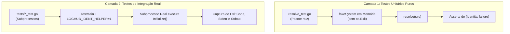

# 07 — Estratégia de Testes, Harness e Benchmarks

> **Status:** Canônico e Normativo  
> **Escopo:** Arquitetura de testes em duas camadas (unitários puros com mock vs integração real com subprocessos), harness `TestMain`, neutralização de ambiente, anti-regressão permanente e metas de benchmark.

---

## 1. Arquitetura de Testes em Duas Camadas

Como a biblioteca chama `os.Exit(código)` em caso de erro, a estratégia de testes foi estruturada em duas camadas complementares:



### Camada 1: Testes Unitários Puros (`resolve_test.go`)
- **Alvo:** A função pura `resolve(sys system) (*identity, *failure)`.
- **Mecanismo:** Utiliza o mock `fakeSystem`, que emula em memória o mapa de variáveis de ambiente, arquivos virtuais, `argv`, `hostname` e erros simulados.
- **Vantagem:** Execução em nanossegundos, sem chamadas ao SO e sem risco de abortar o processo de teste. Permite cobrir caminhos inalcançáveis por fora (como falhas internas da syscall `Hostname()` ou de `GenerateUUIDv7()`, testando os códigos **105**, **108** e **114**).

### Camada 2: Testes de Integração Ponta a Ponta (`tests/`)
- **Alvo:** A função pública real `Initialize()` e os getters públicos contra o sistema operacional real (arquivos reais em diretórios temporários, concorrência entre processos, FIFOs e symlinks).
- **Mecanismo:** Harness de subprocesso baseado em `TestMain` em [`tests/helper_test.go`](file:///Users/patrickbrandao/Projects/loghub/go-loghub-ident/tests/helper_test.go).

---

## 2. O Harness de Subprocesso (`helper_test.go`)

Quando `go test ./tests/` é executado, o processo principal executa `TestMain`:

```go
func TestMain(m *testing.M) {
    if os.Getenv("LOGHUB_IDENT_HELPER") == "1" {
        // Modo filho: executa a inicialização real e imprime os resultados
        loghubident.Initialize()
        fmt.Printf("DATADIR=%s\n", loghubident.DataDir())
        fmt.Printf("MACHINE_ID=%s\n", loghubident.MachineID())
        fmt.Printf("AGENT_NAME=%s\n", loghubident.AgentName())
        fmt.Printf("AGENT_UUID=%s\n", loghubident.AgentUUID())
        fmt.Printf("HOSTNAME=%s\n", loghubident.Hostname())
        fmt.Printf("WORKSPACE=%s\n", loghubident.Workspace())
        os.Exit(0)
    }
    // Modo pai: roda a suíte de testes que spawna os processos filhos
    os.Exit(m.Run())
}
```

### Isolamento e Neutralização Determinística do Host
Para evitar que configurações da máquina do desenvolvedor ou do servidor de CI contaminem os testes:
- O subprocesso recebe um mapa de ambiente limpo e controlado.
- O arquivo de host padrão `/etc/machine-id` é neutralizado deterministamente nos testes, apontando `MACHINE_ID_FILE` para um arquivo temporário controlado.

### Cobertura de Código em Subprocessos
A cobertura de código gerada dentro dos subprocessos é agregada automaticamente ao binário pai utilizando o parâmetro:
```bash
go test ./tests/ -coverpkg=github.com/patrickbrandao/go-loghub-ident
```

---

## 3. Testes de Anti-Regressão Permanente (`TestFix_BUGxx`)

Os arquivos [`tests/bugs_test.go`](file:///Users/patrickbrandao/Projects/loghub/go-loghub-ident/tests/bugs_test.go) e [`tests/bugs2_test.go`](file:///Users/patrickbrandao/Projects/loghub/go-loghub-ident/tests/bugs2_test.go) contêm testes permanentes dedicados a imortalizar cada um dos 20 defeitos catalogados em [`06-ENGINEERING-LESSONS-AND-ANTI-REGRESSION.md`](file:///Users/patrickbrandao/Projects/loghub/go-loghub-ident/docs/06-ENGINEERING-LESSONS-AND-ANTI-REGRESSION.md):

- Cada teste é nomeado como `TestFix_BUGxx_<Descrição>` e documenta detalhadamente a condição que falhava e o comportamento correto esperado.
- **Regra:** Nenhum teste `TestFix_` pode ser removido ou afrouxado.

Para rodar apenas os testes de regressão:
```bash
go test ./tests/ -run TestFix -v
```

---

## 4. Metas de Benchmark e Eficiência

O arquivo [`tests/bench_test.go`](file:///Users/patrickbrandao/Projects/loghub/go-loghub-ident/tests/bench_test.go) audita rigorosamente a performance da biblioteca contra regressões de latência e consumo de memória:

| Operação Auditada | Meta de Tempo | Meta de Alocação | Comentário / Justificativa |
| :--- | :---: | :---: | :--- |
| **Getters Públicos** (`DataDir()`, etc.) | **< 0,5 ns/op** | **0 B/op (0 allocs)** | Leitura $O(1)$ direta de memória, sem locks nem overhead atômico. |
| **Validador Manual** (`validMachineID`) | **< 15 ns/op** | **0 B/op (0 allocs)** | Validação manual byte a byte sem compilar nem executar regex. |
| **Validador Manual** (`validHostname`) | **< 40 ns/op** | **0 B/op (0 allocs)** | Validação por rótulos da RFC 1123 com alocação zero de heap. |
| **Ciclo Completo de Boot** (`Initialize()`) | **< 450 µs/op** | Mínima | Resolução total dos 6 campos a frio. |

Para executar os benchmarks:
```bash
go test ./tests/ -bench=. -benchmem -run=XXX
```

---

## 5. Comandos Canônicos de Verificação

```bash
# 1. Executar todos os testes do repositório
go test ./...

# 2. Executar suíte de integração com detector de corridas (race detector)
go test -race ./tests/

# 3. Executar testes rápidos ignorando testes concorrentes pesados
go test -short ./tests/

# 4. Medir cobertura de código real dos subprocessos
go test ./tests/ -coverpkg=github.com/patrickbrandao/go-loghub-ident

# 5. Verificação estática rigorosa
go vet ./...
```
