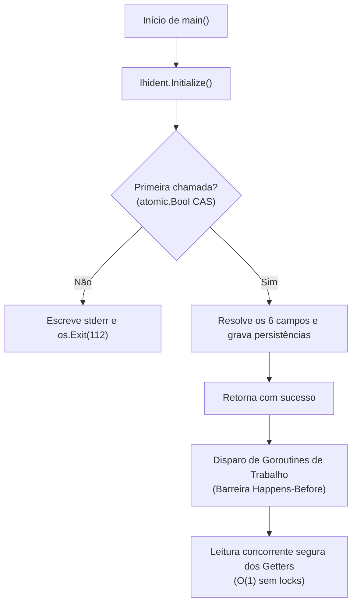

# Skill: Integração e Operação do `go-loghub-ident`

Esta skill orienta desenvolvedores e agentes de IA a implementar, configurar e operar o identificador canônico de serviços do ecossistema Loghub utilizando a biblioteca Go [`github.com/patrickbrandao/go-loghub-ident`](https://github.com/patrickbrandao/go-loghub-ident) (`lhident`).

---

## 1. O que é a biblioteca e por que usá-la?

A biblioteca resolve seis atributos fundamentais de identidade para qualquer processo ou microsserviço:
- **`DataDir()`**: Diretório raiz de dados persistentes do processo (padrão `/data`).
- **`MachineID()`**: Identificador de 32 hexadecimais do nó/máquina física ou virtual.
- **`AgentName()`**: Nome do serviço no ecossistema (máx. 64 caracteres).
- **`AgentUUID()`**: UUIDv7 temporalmente ordenável único da instância.
- **`Hostname()`**: Nome do host do sistema em conformidade estrita com a RFC 1123.
- **`Workspace()`**: Tenant ou namespace lógico do agente (padrão `"default"`).

### Características-Chave de Engenharia:
- **Alta Performance:** Leituras $O(1)$ sem mutexes ou disputa de locks em memória.
- **Resiliente em Volumes Compartilhados:** Garante convergência atômica entre containers principais e sidecars competindo pelo mesmo volume.
- **Segurança Reforçada:** Permissão `0644` imune a `umask` restritivo de containers, proteção contra links simbólicos e rejeição a *path traversal*.
- **Sem Dependência de Regex:** Inicialização ultrarrápida sem importar `regexp`.

---

## 2. Início Rápido em 2 Minutos

### Passo 1: Adicionar a Dependência
```bash
go get github.com/patrickbrandao/go-loghub-ident
```
> **Requisito:** Go 1.22 ou superior.

### Passo 2: Inicializar no Ponto de Entrada da Aplicação (`main.go`)
```go
package main

import (
	"fmt"

	lhident "github.com/patrickbrandao/go-loghub-ident"
)

func main() {
	// 1. OBRIGATÓRIO: Chamar Initialize() no topo de main(), antes de criar goroutines
	lhident.Initialize()

	// 2. Os getters agora podem ser lidos concorrentemente em qualquer lugar
	fmt.Printf("Identidade do Serviço:\n")
	fmt.Printf("  DataDir:   %s\n", lhident.DataDir())
	fmt.Printf("  MachineID: %s\n", lhident.MachineID())
	fmt.Printf("  AgentName: %s\n", lhident.AgentName())
	fmt.Printf("  AgentUUID: %s\n", lhident.AgentUUID())
	fmt.Printf("  Hostname:  %s\n", lhident.Hostname())
	fmt.Printf("  Workspace: %s\n", lhident.Workspace())
}
```

### Passo 3: Execução Rápida

#### Cenário A: Caminho Feliz via Variáveis (Sem Tocar Disco / Read-Only Filesystem)
Ideal para containers efêmeros e ambientes serverless:
```bash
MACHINE_ID=abcdef0123456789abcdef0123456789 \
AGENT_NAME=my-service \
AGENT_UUID=019e99e3-42f0-7882-9719-2305ff84949c \
HOSTNAME=node01 \
WORKSPACE=production \
go run main.go
```

#### Cenário B: Identidade Persistente em Volume
A biblioteca gera localmente o `machine_id` e o `agent_uuid` na 1ª execução e os reutiliza estavelmente nas reinicializações:
```bash
mkdir -p /tmp/mydata
DATADIR=/tmp/mydata WORKSPACE=staging go run main.go
```

---

## 3. Contrato de Ciclo de Vida e Concorrência



1. **Chamada Única:** Invoque `Initialize()` **apenas uma vez**. Uma segunda chamada no mesmo processo é detectada atomicamente e encerra o processo com **código de saída 112**.
2. **Barreira *Happens-Before*:** `Initialize()` deve concluir **antes** do disparo de goroutines que leem os getters. A criação das goroutines estabelece a sincronização de memória necessária para leitura sem locks.
3. **Imutabilidade Absoluta:** Uma vez inicializados, os valores nunca mais mudam durante a vida do processo.

---

## 4. Tabela de Referência de Variáveis de Ambiente

| Variável | Campo Afetado | Padrão / Fallback | Regras de Formato e Validação |
| :--- | :--- | :--- | :--- |
| `DATADIR` | `DataDir()` | `/data` | **Caminho absoluto obrigatório** (iniciado por `/` no Unix ou letra de unidade no Windows). Não pode conter caracteres de controle. Normalizado via `filepath.Clean`. |
| `MACHINE_ID` | `MachineID()` | `$MACHINE_ID_FILE` ou `$DATADIR/machine_id` ou gerado via UUIDv7 | Sequência de 32 hexadecimais `^[0-9a-f]{32}$`. Hífens inseridos são removidos automaticamente. |
| `MACHINE_ID_FILE` | `MachineID()` | `/etc/machine-id` | Caminho do arquivo de identidade do SO. Se informado, deve ser absoluto, acessível e menor que 4 KiB. |
| `AGENT_NAME` | `AgentName()` | `$DATADIR/agent_name` ou base de `argv[0]` | 1 a 64 caracteres em `^[a-z0-9._-]+$`. **Rejeita expressamente `.` e `..`** (proteção contra path traversal). |
| `AGENT_UUID` | `AgentUUID()` | `$DATADIR/agent_uuid` ou gerado via UUIDv7 | UUIDv7 canônico com hífens RFC 9562 (`^[0-9a-f]{8}-[0-9a-f]{4}-7[0-9a-f]{3}-[89ab][0-9a-f]{3}-[0-9a-f]{12}$`). |
| `HOSTNAME` | `Hostname()` | Chamada `os.Hostname()` | Padrão RFC 1123: máx. 253 chars, rótulos de 1 a 63 chars sem hífens nas extremidades. |
| `WORKSPACE` | `Workspace()` | `$DATADIR/workspace` ou `"default"` | 1 a 64 caracteres em `^[a-z0-9.-]+$`. **Rejeita `.` e `..` e não aceita `_`**. |
| `LOGHUB_IDENT_DEBUG` | Diagnóstico | Vazio (desativado) | Qualquer valor não-vazio (`"1"`) ativa a emissão de 6 linhas de diagnóstico em `stderr`. |

---

## 5. Gestão de Volumes e Persistência em Disco

### Arquivos Gerenciados em `$DATADIR`:
- `machine_id`: 32 hexadecimais em lowercase. Permissão `0644`.
- `agent_uuid`: UUIDv7 canônico RFC 9562 com hífens. Permissão `0644`.
- `agent_name`: Arquivo estático opcional (apenas leitura pela biblioteca).
- `workspace`: Arquivo estático opcional (apenas leitura pela biblioteca).
- `.machine_id.regen` e `.agent_uuid.regen`: Registros ocultos de arbitragem de recuperação concorrente.

### Regras Críticas de Operação de Volumes:
1. **Gravação Atômica e Durável:** As gravações usam arquivos temporários com `fchmod(0644)`, `fsync` do arquivo e `fsync` do diretório pai. Quedas de energia não deixam arquivos corrompidos de 0 bytes.
2. **Convergência entre Sidecars:** Containers que compartilham intencionalmente o mesmo `$DATADIR` (ex.: container de aplicação e sidecar de coleta de logs no mesmo Pod) convergem automaticamente para os mesmos IDs via criação exclusiva (`CreateExclusive`).
3. **Isolamento entre Réplicas:** **NUNCA compartilhe o mesmo volume gravável `$DATADIR` entre Pods ou servidores distintos.** Isso causaria colisão de `machine_id` e `agent_uuid`, gerando duplicações no servidor Loghub.
4. **Proteção contra Symlinks:** A biblioteca recusa links simbólicos dentro de `$DATADIR` (`ReadFileNoFollow`) com código 100 para impedir exfiltração de arquivos do host.

---

## 6. Observabilidade e Monitoramento

### 6.1. Depuração com `LOGHUB_IDENT_DEBUG=1`
Ao ativar a variável de depuração, o processo emite exatamente 6 linhas em `stderr` antes de qualquer execução ou falha:
```text
lib-loghub-ident: debug: DATADIR: env = "/data"
lib-loghub-ident: debug: MACHINE_ID: file /etc/machine-id = "0123456789abcdef0123456789abcdef"
lib-loghub-ident: debug: AGENT_NAME: fallback argv[0] = "my-service"
lib-loghub-ident: debug: AGENT_UUID: generated = "018f3a5b-7c8d-7e9f-8a1b-2c3d4e5f6a7b"
lib-loghub-ident: debug: HOSTNAME: os.Hostname = "node01.example.com"
lib-loghub-ident: debug: WORKSPACE: fallback = "default"
```

### 6.2. Alarme Operacional Obrigatório (`lib-loghub-ident: aviso:`)
Se um arquivo persistido em `$DATADIR` for encontrado com conteúdo corrompido, a biblioteca regenera a identidade e emite um aviso compulsório em `stderr`:
```text
lib-loghub-ident: aviso: MACHINE_ID: /data/machine_id tinha conteúdo inválido (16 bytes, hash ...) e será REGERADO; a identidade desta máquina muda a partir de agora
```
> **Ação Recomendada:** Configure alertas no seu agregador de logs (ex.: Datadog, CloudWatch, Loki) para a string `lib-loghub-ident: aviso:`. Essa linha indica que o nó trocou de identidade física, o que pode impactar faturamento de licenças por host e continuidade de séries temporais.

---

## 7. Diagnóstico Rápido de Códigos de Saída (Exit Codes)

Se o processo encerrar durante o boot com código entre 100 e 114, consulte esta tabela:

| Código | Variável | Significado | Como Corrigir |
| :---: | :--- | :--- | :--- |
| **100** | `DATADIR` | Caminho relativo, inexistente na escrita, não é diretório ou symlink recusado. | Configure `DATADIR` como caminho absoluto (ex.: `/var/lib/myapp`), monte o volume como diretório real e assegure permissões de leitura/escrita. |
| **100** | `MACHINE_ID_FILE` | Caminho explícito relativo, inacessível, FIFO ou > 4 KiB. | Verifique se o caminho informado em `MACHINE_ID_FILE` é absoluto, arquivo comum regular e possui permissão de leitura. |
| **102** | `MACHINE_ID` | Formato não hexadecimal ou comprimento != 32. | Forneça 32 caracteres hexadecimais `0-9a-f` (com ou sem hífens). |
| **103** | `AGENT_NAME` | Todas as fontes de nome do agente vazias. | Defina `AGENT_NAME` na env ou passe um nome de executável válido. |
| **104** | `AGENT_NAME` | Nome contém caracteres inválidos, > 64 chars ou é `.` / `..`. | Use apenas letras minúsculas, números, ponto, hífen e sublinhado (`[a-z0-9._-]`). |
| **105** | `AGENT_UUID` | Falha interna na geração de UUIDv7. | Não ocorre com o gerador atual (`go-loghub-uuidv7` não retorna erro). Se aparecer, trate como defeito da biblioteca. |
| **106** | `AGENT_UUID` | Falha de gravação no volume `$DATADIR/agent_uuid`. | Verifique espaço em disco, quota de inodes e permissões de escrita em `$DATADIR`. |
| **107** | `AGENT_UUID` | Valor não é um UUIDv7 canônico com hífens. | Corrija o valor de `AGENT_UUID` para o padrão RFC 9562 (36 caracteres). |
| **108** | `HOSTNAME` | Chamada ao sistema `os.Hostname()` falhou. | Configure a variável de ambiente `HOSTNAME` explicitamente. |
| **109** | `HOSTNAME` | Hostname não atende à RFC 1123. | Ajuste o hostname para conter apenas `[a-z0-9.-]`, sem hífens nas bordas dos rótulos e máx. 253 caracteres. |
| **111** | `WORKSPACE` | Workspace inválido (> 64 chars, caracteres inválidos ou `.`/`..`). | Ajuste `WORKSPACE` para conter apenas `[a-z0-9.-]` (não use `_`). |
| **112** | `geral` | `Initialize()` chamado mais de uma vez. | Remova invocações duplicadas de `lhident.Initialize()` no seu código Go. |
| **113** | `MACHINE_ID` | Falha de gravação no volume `$DATADIR/machine_id`. | Verifique permissões de escrita e espaço no disco em `$DATADIR`. |
| **114** | `MACHINE_ID` | Falha interna na geração de UUID para machine-id. | Não ocorre com o gerador atual (`go-loghub-uuidv7` não retorna erro). Se aparecer, trate como defeito da biblioteca. |

---

## 8. Receitas de Implantação Prontas

### 8.1. Dockerfile Distroless Multi-Stage
Veja a receita completa em [`examples/docker/Dockerfile`](./examples/docker/Dockerfile).

```dockerfile
FROM golang:1.22 AS build
WORKDIR /src
COPY go.mod go.sum ./
RUN go mod download
COPY . .
RUN CGO_ENABLED=0 GOOS=linux go build -ldflags="-w -s" -o /out/app .

FROM gcr.io/distroless/static-debian12
COPY --from=build /out/app /app
VOLUME ["/data"]
ENV WORKSPACE=production
ENTRYPOINT ["/app"]
```

### 8.2. Kubernetes Pod (Compartilhamento entre Aplicação e Sidecar)
Veja o manifesto completo em [`examples/kubernetes/pod.yaml`](./examples/kubernetes/pod.yaml).

---

## 9. Recursos Adicionais

- **[Referência Completa de Configuração](./references/configuration.md)**: Detalhamento minucioso de cada fallback e fluxo de decisão.
- **[Guia Avançado de Troubleshooting](./references/troubleshooting.md)**: Diagnóstico aprofundado para falhas complexas em produção.
- **[Exemplo Executável Mínimo](./examples/minimal/main.go)**: Demonstração concisa em poucas linhas.
- **[Exemplo Executável Concorrente](./examples/basic/main.go)**: Código Go completo demonstrando leituras concorrentes com goroutines.
