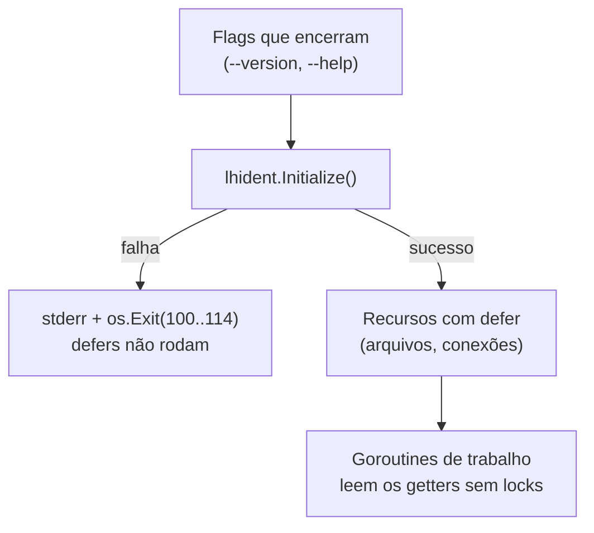

# Integração e Operação do `go-loghub-ident`

> **Versão documentada:** `v0.5.2` de [`github.com/patrickbrandao/go-loghub-ident`](https://github.com/patrickbrandao/go-loghub-ident).
> Se o `go.mod` do projeto exigir outra versão, confira o README dessa tag antes de seguir esta skill.

## Projeto e versão

| Item | Valor |
| :--- | :--- |
| Repositório no GitHub | [github.com/patrickbrandao/go-loghub-ident](https://github.com/patrickbrandao/go-loghub-ident) |
| Caminho do módulo Go | `github.com/patrickbrandao/go-loghub-ident` |
| Última versão lançada (quando esta skill foi publicada) | `v0.5.2` |
| Releases e notas de versão | [github.com/patrickbrandao/go-loghub-ident/releases](https://github.com/patrickbrandao/go-loghub-ident/releases) |

Use sempre este módulo — não há fork nem espelho oficial. Para conferir se saiu versão mais nova que a desta skill:
```bash
go list -m -versions github.com/patrickbrandao/go-loghub-ident
```
Se houver versão mais nova, leia as notas da release antes de atualizar e atualize a skill junto (ela descreve o comportamento da versão documentada).

## 1. O que a biblioteca resolve

A biblioteca dá ao processo, de forma estável entre reinícios:
- uma **identidade única** — *quem* é este agente: `AgentUUID()`, `AgentName()` e `Hostname()`;
- uma **localização virtual** — *onde* ele está: `MachineID()` e `Workspace()`.

API pública completa (pacote `loghubident`, alias convencional `lhident`):

| Símbolo | Retorno | Conteúdo |
| :--- | :--- | :--- |
| `Initialize()` | — | Resolve os seis campos. Chamada única; em falha **encerra o processo** (não retorna erro). |
| `IsInitialized()` | `bool` | `true` depois que `Initialize()` concluiu com sucesso. |
| `DataDir()` | `string` | Diretório de dados (padrão `/data`). Suporte, não identidade: é onde `machine_id` e `agent_uuid` gerados são gravados. |
| `MachineID()` | `string` | 32 hexadecimais minúsculos, sem hífen: o nó físico ou virtual. |
| `AgentName()` | `string` | Nome do serviço, `[a-z0-9._-]`, até 64 caracteres. |
| `AgentUUID()` | `string` | UUIDv7 canônico com hífens: a instância do agente. |
| `Hostname()` | `string` | Hostname em minúsculas, válido pela RFC 1123. |
| `Workspace()` | `string` | Tenant lógico, `[a-z0-9.-]`, até 64 caracteres (padrão `default`). |
| `DefaultDataDir`, `DefaultMachineIDFile`, `DefaultWorkspace`, `EnvDebug` | `const` | `"/data"`, `"/etc/machine-id"`, `"default"`, `"LOGHUB_IDENT_DEBUG"`. |

Os getters são leituras de memória O(1), sem locks, seguras para qualquer número de goroutines depois de `Initialize()`. `AgentName()` e `Workspace()` nunca contêm `/` nem são `.` ou `..`: são seguros para compor caminhos, tópicos e chaves.

---

## 2. Início rápido

### Passo 1: adicionar a dependência (Go 1.22+)
```bash
go get github.com/patrickbrandao/go-loghub-ident@v0.5.2
```

### Passo 2: inicializar no `main()`
```go
package main

import (
	"fmt"

	lhident "github.com/patrickbrandao/go-loghub-ident"
)

func main() {
	// Antes de abrir recursos com defer e antes de criar goroutines.
	// Em qualquer falha, escreve o motivo em stderr e encerra o processo.
	lhident.Initialize()

	fmt.Println("DataDir:  ", lhident.DataDir())
	fmt.Println("MachineID:", lhident.MachineID())
	fmt.Println("AgentName:", lhident.AgentName())
	fmt.Println("AgentUUID:", lhident.AgentUUID())
	fmt.Println("Hostname: ", lhident.Hostname())
	fmt.Println("Workspace:", lhident.Workspace())
}
```

### Passo 3: rodar localmente

> **Atenção:** sem `DATADIR`, a biblioteca usa `/data`, que não existe em máquinas de desenvolvimento (e não pode ser criado no macOS). Se ela precisar gerar uma identidade, o processo encerra com `lib-loghub-ident: DATADIR: "/data" não existe` e **código 100**. Use um dos cenários abaixo.

**Cenário A — tudo via env, sem tocar o disco** (testes, containers read-only, serverless):
```bash
MACHINE_ID=abcdef0123456789abcdef0123456789 \
AGENT_NAME=my-service \
AGENT_UUID=019e99e3-42f0-7882-9719-2305ff84949c \
HOSTNAME=node01 \
WORKSPACE=production \
go run .
```

**Cenário B — identidade gerada e persistida num diretório local:**
```bash
mkdir -p /tmp/my-service-data
DATADIR=/tmp/my-service-data AGENT_NAME=my-service go run .
```
Na primeira execução `machine_id` e `agent_uuid` são gerados e gravados em `/tmp/my-service-data`; nas seguintes, reutilizados. Sem `AGENT_NAME`, o nome vem do executável: `go run .` usa o nome do diretório do pacote e `go run main.go` usa `main`.

---

## 3. Regras de integração

Siga estas regras ao escrever ou revisar código que usa a biblioteca:

1. **Somente no `main()` do binário, uma única vez.** Nunca em `init()`, em pacote de biblioteca, em handler, em retry ou em teste individual. Uma segunda chamada no mesmo processo encerra com **código 112**. Pacotes compartilhados apenas leem os getters; se precisarem se proteger de uso sem inicialização, consultem `lhident.IsInitialized()`.
2. **Ordem dentro do `main()`:** trate primeiro as flags que encerram o programa sem precisar de identidade (`--version`, `--help`); depois chame `Initialize()`; só então abra arquivos, conexões e outros recursos com `defer`, e crie goroutines.
3. **Não há erro para tratar.** Em falha, `Initialize()` chama `os.Exit` com um código entre 100 e 114: `defer` não roda e `recover` não captura. Não envolva a chamada em lógica de fallback; corrija a configuração.
4. **Getters antes de `Initialize()` devolvem `""`.** Não leia identidade em `init()` nem em variáveis globais inicializadas em tempo de carga do pacote.
5. **Barreira *happens-before*:** goroutines criadas depois de `Initialize()` retornar leem os getters sem sincronização. Não adicione mutex nem cache em volta deles.
6. **Defina `AGENT_NAME` explicitamente em containers.** O fallback é o nome base de `argv[0]` — `/app` vira `app` em toda imagem que usa esse caminho.
7. **Não escreva nos arquivos gerenciados** (`$DATADIR/machine_id`, `$DATADIR/agent_uuid`, `.*.regen`). Para fixar um valor, use a variável de ambiente correspondente; para trocar a identidade, siga a seção 6.


```mermaid
flowchart TD
    Flags["Flags que encerram<br>(--version, --help)"] --> Init["lhident.Initialize()"]
    Init -->|falha| Exit["stderr + os.Exit(100..114)<br>defers não rodam"]
    Init -->|sucesso| Res["Recursos com defer<br>(arquivos, conexões)"]
    Res --> Go["Goroutines de trabalho<br>leem os getters sem locks"]
```

---

## 4. Testes no projeto consumidor

Cada pacote de teste é um processo próprio: chame `Initialize()` **uma vez**, no `TestMain`, com as cinco variáveis de identidade definidas. Assim a biblioteca não toca o disco e os valores são determinísticos:

```go
func TestMain(m *testing.M) {
	for k, v := range map[string]string{
		"MACHINE_ID": "0123456789abcdef0123456789abcdef",
		"AGENT_NAME": "my-service-test",
		"AGENT_UUID": "019e99e3-42f0-7882-9719-2305ff84949c",
		"HOSTNAME":   "test-host",
		"WORKSPACE":  "test",
	} {
		os.Setenv(k, v)
	}
	lhident.Initialize()
	os.Exit(m.Run())
}
```

- Não chame `Initialize()` dentro de `TestXxx` nem use `t.Setenv` para variar a identidade: a segunda chamada derruba o binário de teste inteiro com código 112.
- Para testar comportamentos com identidades diferentes, faça o código receber os valores como parâmetros (ou um struct) preenchidos no `main()` a partir dos getters, e teste esse código sem a biblioteca.

---

## 5. Variáveis de ambiente

Os campos são resolvidos nesta ordem, e a primeira falha encerra o processo: `DATADIR` → `MACHINE_ID` → `AGENT_NAME` → `AGENT_UUID` → `HOSTNAME` → `WORKSPACE`. Todo valor (env ou arquivo) passa pelo mesmo saneamento: primeira linha, sem BOM UTF-8, sem espaços e caracteres de controle nas bordas, em minúsculas.

| Variável | Campo | Fontes, em ordem | Regras |
| :--- | :--- | :--- | :--- |
| `DATADIR` | `DataDir()` | env → `/data` | Caminho absoluto, sem caracteres de controle; normalizado com `filepath.Clean`. Só precisa existir quando algo é lido de lá ou uma identidade é gerada. Pode ser um link simbólico para o volume real. |
| `MACHINE_ID` | `MachineID()` | env → `$MACHINE_ID_FILE` → `$DATADIR/machine_id` → gerado | 32 hexadecimais; hífens são removidos (`uuidgen \| tr -d -` serve). Env inválida → 102. |
| `MACHINE_ID_FILE` | `MachineID()` | env → `/etc/machine-id` | Absoluto, arquivo comum, até 4 KiB. Arquivo **inexistente** não é erro: usa `/etc/machine-id`. Conteúdo inválido cai para o próximo nível. |
| `AGENT_NAME` | `AgentName()` | env → `$DATADIR/agent_name` → base de `argv[0]` sem `.exe` | `[a-z0-9._-]`, 1 a 64 caracteres, nunca `.` ou `..`. |
| `AGENT_UUID` | `AgentUUID()` | env → `$DATADIR/agent_uuid` → gerado | UUID **versão 7** canônico, 36 caracteres. UUIDv4 (o que `uuidgen` produz) é recusado com 107. |
| `HOSTNAME` | `Hostname()` | env → `os.Hostname()` | RFC 1123: até 253 caracteres, rótulos de 1 a 63 em `[a-z0-9-]` sem hífen nas bordas. `_`, espaço e ponto final (`host.`) são recusados. |
| `WORKSPACE` | `Workspace()` | env → `$DATADIR/workspace` → `"default"` | `[a-z0-9.-]`, 1 a 64 caracteres, nunca `.` ou `..`. **Não aceita `_`.** |
| `LOGHUB_IDENT_DEBUG` | — | — | Qualquer valor não vazio liga o diagnóstico (inclusive `0` e `false`). |

Para fixar um `AGENT_UUID` via env, copie o `agent_uuid` que a biblioteca gerou num `DATADIR`, ou gere um UUIDv7 (por exemplo, Python 3.14+: `python3 -c 'import uuid; print(uuid.uuid7())'`).

---

## 6. Volumes e persistência

### Arquivos em `$DATADIR`
- `machine_id`, `agent_uuid`: gerados pela biblioteca, uma linha, permissão `0644`, gravação atômica com `fsync`.
- `agent_name`, `workspace`: opcionais, escritos pelo operador; a biblioteca só lê.
- `.machine_id.regen`, `.agent_uuid.regen`: registros da recuperação concorrente de um arquivo corrompido.

Arquivos dentro de `$DATADIR` não podem ser links simbólicos, FIFOs ou ter mais de 4 KiB: a biblioteca recusa com **código 100** (proteção contra exfiltração de arquivos do host).

### Regras de operação
1. **Volume durável:** a identidade só é estável se o volume sobreviver à recriação do container. Docker: volume **nomeado** (`-v meu-servico-ident:/data`). Kubernetes: PVC por Pod, ou `volumeClaimTemplates` num StatefulSet. `emptyDir`, volumes anônimos e `--rm` sem volume nomeado geram identidade nova a cada recriação, **sem aviso** (o arquivo está ausente, não corrompido).
2. **Escrita pelo usuário do processo:** em imagens nonroot, o diretório precisa pertencer ao UID/GID do processo (veja o Dockerfile de exemplo) ou o Pod precisa de `securityContext.fsGroup`. Sem isso, a primeira geração falha com **113** (`permission denied`).
3. **Um volume por instância:** **nunca** monte o mesmo `$DATADIR` gravável em réplicas ou servidores distintos — todos reportariam o mesmo `AgentUUID` e `MachineID`.
4. **Sidecars no mesmo Pod:** containers que compartilham de propósito o mesmo `$DATADIR` convergem para o mesmo `MachineID` e o mesmo `AgentUUID` (a instância é o Pod); `AGENT_NAME` distingue cada um. Se cada container precisar do seu próprio `AgentUUID`, defina `AGENT_UUID` em cada um ou dê a cada um o seu `DATADIR`.
5. **Volume read-only:** funciona se `machine_id` e `agent_uuid` já existirem válidos no volume. Caso contrário, defina `MACHINE_ID` e `AGENT_UUID` na env; sem eles, a geração falha com 113 ou 106.

### Trocar a identidade de propósito
Pare todos os processos que usam o volume, **apague** `$DATADIR/agent_uuid` (e/ou `machine_id`) e reinicie. Não esvazie o arquivo: arquivo vazio é tratado como corrompido e a biblioteca restaura o valor do registro `.regen`, se houver. A criação do zero descarta o registro antigo.

### Arquivo corrompido ou vazio
Conteúdo inválido (truncado, lixo, 0 bytes) gera aviso em `stderr` e uma identidade nova (seção 7.2). Um arquivo vazio modificado há menos de 10 s ainda é aguardado até completar essa janela, porque pode ser o que um processo irmão acabou de publicar num volume de rede; um vazio antigo é regenerado na hora.

---

## 7. Observabilidade

### 7.1. Diagnóstico com `LOGHUB_IDENT_DEBUG=1`
Escreve em `stderr` uma linha por campo resolvido (seis), precedidas, quando houver, por linhas sobre fontes ignoradas. Em falha, as linhas dos campos já resolvidos saem antes da mensagem de erro:
```text
lib-loghub-ident: debug: DATADIR: env = "/data"
lib-loghub-ident: debug: MACHINE_ID: file /etc/machine-id = "0123456789abcdef0123456789abcdef"
lib-loghub-ident: debug: AGENT_NAME: fallback argv[0] = "my-service"
lib-loghub-ident: debug: AGENT_UUID: generated = "018f3a5b-7c8d-7e9f-8a1b-2c3d4e5f6a7b"
lib-loghub-ident: debug: HOSTNAME: os.Hostname = "node01.example.com"
lib-loghub-ident: debug: WORKSPACE: fallback = "default"
```
Sem a variável, um boot sem incidentes não escreve nada em `stdout` nem em `stderr`.

### 7.2. Aviso operacional (`lib-loghub-ident: aviso:`)
Emitido **sempre** que uma identidade persistida é descartada:
```text
lib-loghub-ident: aviso: MACHINE_ID: /data/machine_id tinha conteúdo inválido (16 bytes, hash 8f3a1b0c9e7d4a2f) e será substituído (o aviso seguinte diz se foi regenerado ou restaurado de um registro)
lib-loghub-ident: aviso: MACHINE_ID: /data/machine_id foi REGERADO com valor novo (32 bytes, hash 5d41402abc4b2a76); a identidade desta máquina muda a partir de agora
```
Se um processo irmão já tinha regenerado, a segunda linha diz `foi RESTAURADO a partir do registro de regeneração` e o valor registrado é mantido. O hash é FNV-1a 64-bit: identifica o conteúdo sem reproduzi-lo.

> **Recomendação:** crie um alerta no agregador de logs para `lib-loghub-ident: aviso:`. A linha indica que a identidade daquele nó ou agente mudou, o que quebra a continuidade de séries temporais e de qualquer registro chaveado por ela.

---

## 8. Códigos de saída

Em falha, a última linha de `stderr` é `lib-loghub-ident: <VARIÁVEL>: <motivo>`.

| Código | Variável | Causa | Correção |
| :---: | :--- | :--- | :--- |
| **100** | `DATADIR` | Caminho relativo ou com caractere de controle; não existe quando é preciso gravar uma identidade gerada; não é diretório; erro de I/O; arquivo em `$DATADIR` é link simbólico, FIFO ou passa de 4 KiB. | Caminho absoluto de um diretório que existe (ou `MACHINE_ID` e `AGENT_UUID` na env, que dispensam gravação); arquivos comuns no lugar de links. |
| **100** | `MACHINE_ID_FILE` | Caminho relativo ou com controle, inacessível (permissão, I/O), não é arquivo comum ou passa de 4 KiB. | Caminho absoluto de um arquivo comum legível. |
| **102** | `MACHINE_ID` | Env presente que não tem 32 hexadecimais depois de remover hífens. | 32 caracteres `0-9a-f`, com ou sem hífens. |
| **103** | `AGENT_NAME` | Env vazia, `agent_name` ausente e `argv[0]` sem nome base. | Defina `AGENT_NAME`. |
| **104** | `AGENT_NAME` | Env, arquivo ou base de `argv[0]` fora de `[a-z0-9._-]`, mais de 64 caracteres, ou `.`/`..`. | Ajuste o nome ou defina `AGENT_NAME`. |
| **105** | `AGENT_UUID` | Falha na geração do UUIDv7. | Não ocorre com o gerador atual; trate como defeito da biblioteca. |
| **106** | `AGENT_UUID` | Gravação de `$DATADIR/agent_uuid` falhou: volume read-only, sem permissão para o UID do processo, disco ou inodes cheios. | Permissão de escrita (dono do diretório, `fsGroup`) e espaço no volume, ou defina `AGENT_UUID`. |
| **107** | `AGENT_UUID` | Valor não é UUIDv7 canônico (UUIDv4, sem hífens, versão errada). | Use um UUIDv7 (seção 5). |
| **108** | `HOSTNAME` | Env vazia e `os.Hostname()` falhou. | Defina `HOSTNAME`. |
| **109** | `HOSTNAME` | Fora da RFC 1123: `_`, espaço, ponto final, rótulo vazio ou com mais de 63 caracteres, hífen na borda, mais de 253 caracteres. | Defina `HOSTNAME` com um nome válido. |
| **111** | `WORKSPACE` | Env ou arquivo fora de `[a-z0-9.-]`, mais de 64 caracteres, ou `.`/`..`. | Use hífen no lugar de `_`. |
| **112** | `geral` | `Initialize()` chamado mais de uma vez no processo. | Deixe uma única chamada, no `main()` (seção 3). |
| **113** | `MACHINE_ID` | Gravação de `$DATADIR/machine_id` falhou — tipicamente container nonroot com volume do root, ou volume read-only. | Mesmas correções do 106, ou defina `MACHINE_ID`. |
| **114** | `MACHINE_ID` | Falha na geração do UUIDv7 base do machine-id. | Não ocorre com o gerador atual; trate como defeito da biblioteca. |

Mensagens reais de cada caso e o roteiro de diagnóstico: [references/troubleshooting.md](references/troubleshooting.md).

---

## 9. Implantação

### 9.1. Docker
Receita completa e comentada em [examples/docker/Dockerfile](examples/docker/Dockerfile): build multi-arquitetura, imagem distroless nonroot, `/data` pertencente ao usuário nonroot e `AGENT_NAME` definido. Pontos que a receita resolve e que um Dockerfile próprio precisa repetir:
- `/data` criado na imagem com dono `65532:65532` antes de `VOLUME`; sem isso, o primeiro `docker run` com volume nomeado encerra com 113.
- `AGENT_NAME` definido; senão o nome vem do binário (`/app` → `app`).
- `--hostname` no `docker run` (ou `hostname:` no Compose): sem ele, o `Hostname()` é o ID do container e muda a cada recriação.
- `WORKSPACE` vem do ambiente de execução, não da imagem.

### 9.2. Kubernetes
- **Réplicas:** [examples/kubernetes/statefulset.yaml](examples/kubernetes/statefulset.yaml). StatefulSet com `volumeClaimTemplates` dá a cada réplica o seu PVC e um hostname estável (`<nome>-0`, `<nome>-1`, ...). Num Deployment, réplicas que montam o mesmo PVC compartilham a identidade, e com `emptyDir` ela é gerada de novo a cada Pod.
- **App e sidecar no mesmo Pod:** [examples/kubernetes/pod.yaml](examples/kubernetes/pod.yaml). Volume compartilhado de propósito, `AGENT_NAME` diferente em cada container.
- **MachineID do nó:** em containers o `/etc/machine-id` normalmente não existe, e o `MachineID` é gerado por volume. Para que ele identifique o nó do cluster, monte o `/etc/machine-id` do host (`hostPath`, `readOnly`) — trecho comentado no `statefulset.yaml`.
- `HOSTNAME` não precisa ser definido: o hostname do container é o nome do Pod.

---

## 10. Recursos adicionais

- [references/configuration.md](references/configuration.md): cadeia de resolução e regras de cada campo em detalhe.
- [references/troubleshooting.md](references/troubleshooting.md): roteiro de diagnóstico, mensagens reais e cenários de produção.
- [examples/minimal/main.go](examples/minimal/main.go): programa mínimo.
- [examples/basic/main.go](examples/basic/main.go): leitura concorrente dos getters por goroutines.

Para rodar um exemplo isolado: `cd examples/minimal && go mod tidy && go run .` (com as variáveis do Cenário A ou B da seção 2).
